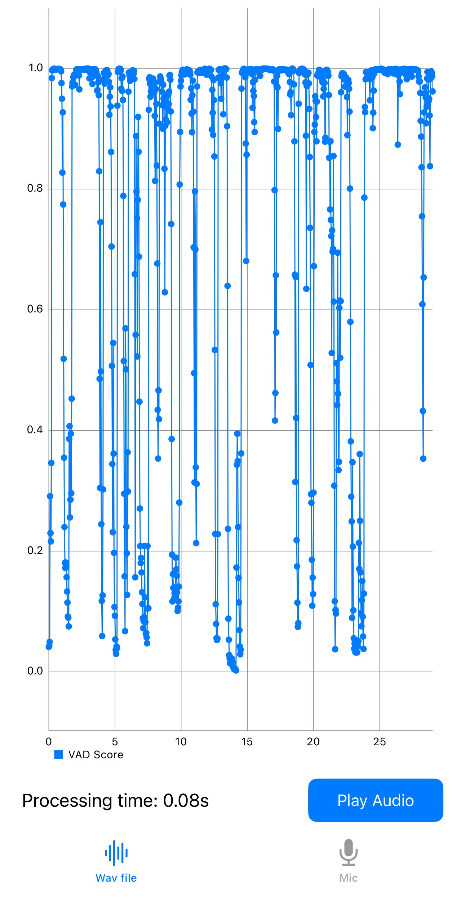
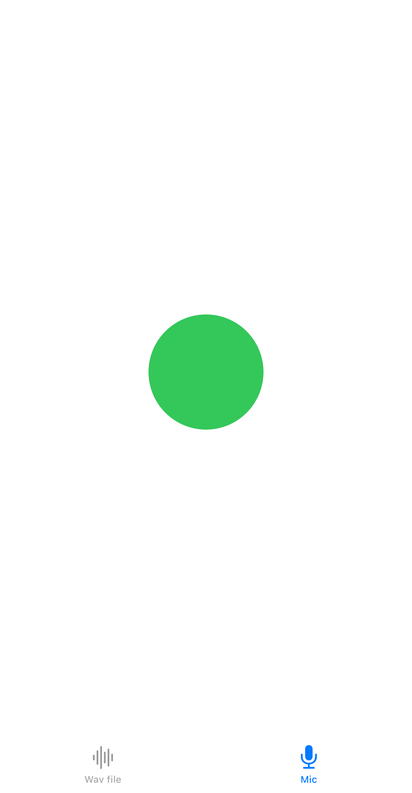

# Silero VAD iOS Demo

This enhanced demo for Silero VAD on iOS is based on [Silero-VAD-for-iOS](https://github.com/tangfuhao/Silero-VAD-for-iOS). While the VAD pod remains unchanged, this version includes a fully functional UI and build fixes for Xcode 16.

- Feng Zhou, 2025.1

<a href="doc/silero-vad-main.png"></a>
<a href="doc/silero-vad-mic.png"></a>

------

README from original author:

## Example

To run the example project, clone the repo, and run `pod install` from the Example directory first.

## Requirements

## Installation

Silero-VAD-for-iOS is available through [CocoaPods](https://cocoapods.org). To install
it, simply add the following line to your Podfile:

```ruby
pod 'Silero-VAD-for-iOS'
```

## Author

fuhao, fangshiyu2@gmail.com

## License

Silero-VAD-for-iOS is available under the MIT license. See the LICENSE file for more info.
